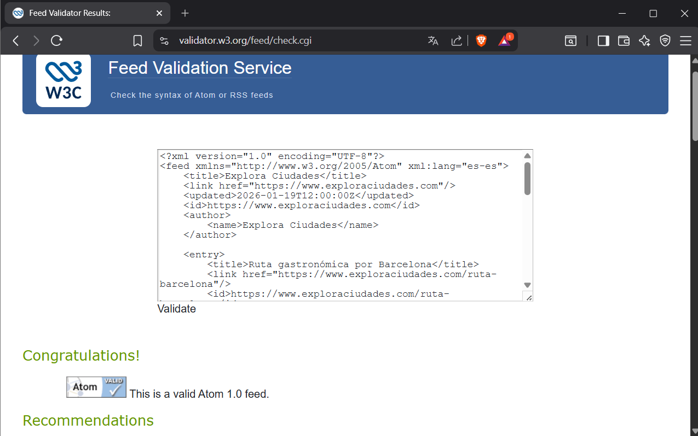

# Proyecto: Feed RSS y Atom - Explora Ciudades

El proyecto consiste en la creación de dos archivos, uno RSS 2.0 y otro Atom 1.0 para el blog de viajes urbanos "Explora Ciudades".

## Archivos incluidos
- `viajes.rss`: Feed en formato RSS 2.0 con 4 entradas sobre rutas urbanas.
- `viajes.atom`: Feed en formato Atom 1.0 con la misma información y fechas validadas.

## Validación
Ambos archivos han sido validados mediante el W3C Feed Validator, asegurando que cumplen con los estándares actuales.

### Prueba de validación RSS

### Prueba de validación Atom
